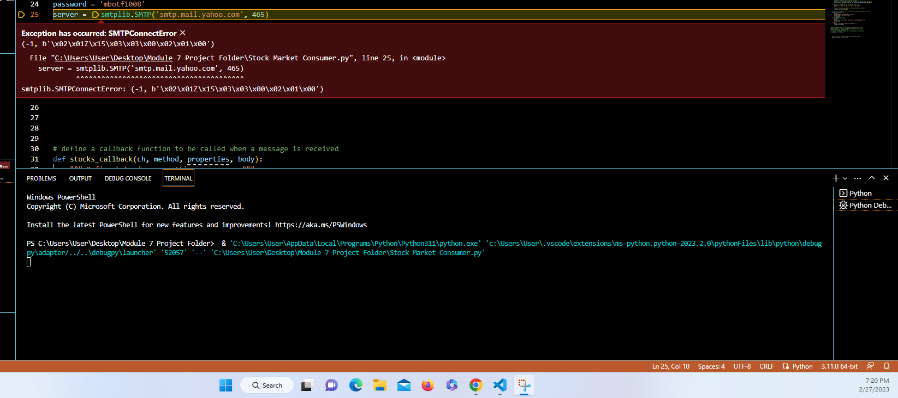

# A7_State_of_the_Art

I downloaded a bunch of stock market data from Kaggle. https://www.kaggle.com/datasets/paultimothymooney/stock-market-data  
However, I only took 10 random stocks from the NASDAQ portion of csv files to use in the project itself.  
I utilized 1 producer that starts out listing the names and starting prices of the 10 stocks that you have the option to monitor.  

Next, it will ask you which email address you would like to receive your notifications at:  

Finally, the producer starts to read the data from the csv file that pertains to the stock that you chose:  

Now, my consumer is supposed to collect the data from the producer and calculate if there has been enough of a price increase that you should think about selling or enough of a price decrease that you should consider buying:  

Unfortunately, I could not get the email portion to work:  

I think that if I could have had more time, I would have figured it out.
